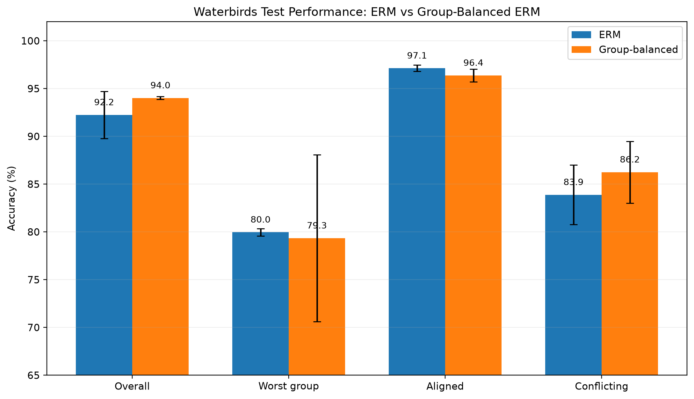
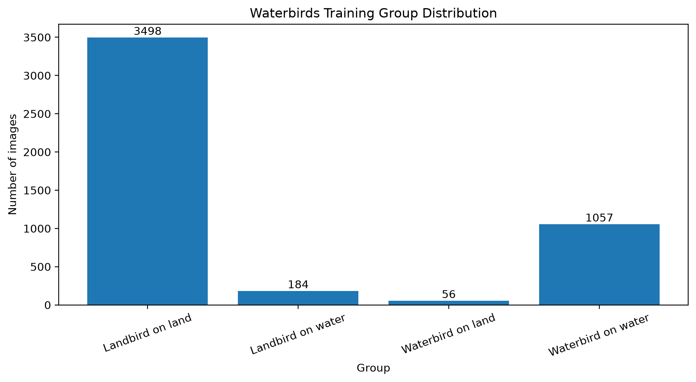
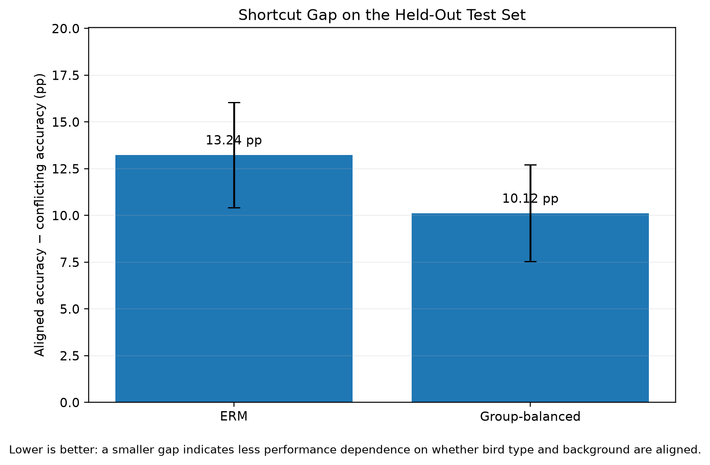
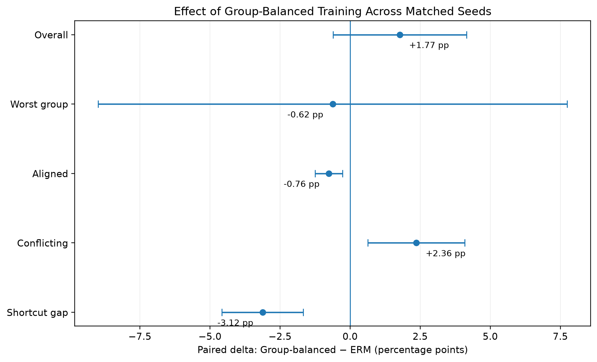

# Right for the Wrong Reasons: Shortcut Learning and Explainability in Image Classification

[](https://github.com/juanmaarg6/shortcut-learning-xai/actions/workflows/ci.yml)
[](LICENSE)

Can an image classifier achieve strong test accuracy while relying on the wrong visual cues?

This project studies **shortcut learning** on the Waterbirds dataset using a pretrained ResNet-50. The main goal is not to maximize headline accuracy, but to measure how much performance depends on a spurious correlation between **bird type** and **background**, test whether a simple group-balanced intervention reduces that dependence, and inspect representative predictions with **Grad-CAM**.

## Key result

A standard ERM classifier achieved strong average performance, but its accuracy was substantially higher when bird type and background followed the spurious training correlation.

| Test metric | ERM | Group-balanced ERM | Paired delta |
|---|---:|---:|---:|
| Overall accuracy | **92.24 ± 2.45%** | **94.01 ± 0.16%** | **+1.77 ± 2.38 pp** |
| Worst-group accuracy | **79.96 ± 0.39%** | **79.34 ± 8.72%** | **−0.62 ± 8.36 pp** |
| Aligned accuracy | **97.12 ± 0.33%** | **96.37 ± 0.66%** | **−0.76 ± 0.49 pp** |
| Conflicting accuracy | **83.88 ± 3.12%** | **86.25 ± 3.24%** | **+2.36 ± 1.73 pp** |
| Shortcut gap | **13.24 ± 2.82 pp** | **10.12 ± 2.58 pp** | **−3.12 ± 1.45 pp** |

Values are mean ± sample standard deviation over seeds **42, 123, and 456**. The shortcut gap is defined as aligned accuracy minus conflicting accuracy, so **lower is better**.

The group-balanced intervention improved average accuracy on conflicting examples and reduced the shortcut gap, but it **did not produce a stable improvement in worst-group accuracy**. The rarest training group contains only 56 unique examples, and oversampling it to roughly 25% of each training epoch increased seed-to-seed variability.



## Dataset: Waterbirds

Waterbirds is constructed so that bird class is strongly correlated with image background during training.

The four groups are:

| Group | Bird type | Background | Train examples |
|---|---|---|---:|
| G0 | Landbird | Land | 3,498 |
| G1 | Landbird | Water | 184 |
| G2 | Waterbird | Land | **56** |
| G3 | Waterbird | Water | 1,057 |

The training split contains **4,795 images**, of which **94.99%** follow the spurious bird/background correlation and only **5.01%** conflict with it. Validation and test are much more balanced with respect to this correlation.



The visual examples make the construction explicit: some birds appear in backgrounds that are highly atypical for their class in the training set.


## Experimental design

Two training strategies are compared while keeping the architecture and optimization protocol fixed.

### ERM baseline

- ResNet-50
- ImageNet-1K V2 initialization
- Full fine-tuning
- AdamW
- Learning rate: `1e-4`
- Weight decay: `1e-4`
- Batch size: `32`
- 15 epochs
- Cosine annealing scheduler
- Automatic mixed precision
- Seeds: `42`, `123`, `456`

The best checkpoint for each seed is selected using **minimum validation cross-entropy loss**. Group labels are not used for model selection.

### Group-balanced ERM

The model and optimization settings are identical to ERM. The only intervention is the training sampler.

Each training example receives inverse-group-frequency sampling weight:

```text
sample_weight(i) = 1 / size(group_i)
```

Sampling is performed with replacement while keeping the number of draws per epoch equal to the original training-set size. This gives each group approximately 25% expected sampling probability.

This is intentionally a simple mitigation rather than a specialized robust-learning method.

## Group-aware evaluation

Reporting only overall accuracy would hide the main failure mode, so evaluation includes:

- overall accuracy;
- accuracy for G0, G1, G2, and G3;
- worst-group accuracy;
- aligned-group macro accuracy;
- conflicting-group macro accuracy;
- shortcut gap.

The per-group test results were:

| Group | ERM | Group-balanced ERM |
|---|---:|---:|
| G0 — Landbird on land | 99.44 ± 0.23% | 99.17 ± 0.42% |
| G1 — Landbird on water | 87.80 ± 5.86% | 93.16 ± 2.26% |
| G2 — Waterbird on land | 79.96 ± 0.39% | 79.34 ± 8.72% |
| G3 — Waterbird on water | 94.81 ± 0.50% | 93.56 ± 1.71% |

For ERM, **G2 is the worst group for all three seeds**. It is also the group with only 56 training examples.



The paired seed comparison shows that the intervention consistently improves average performance on conflicting examples and reduces the shortcut gap, while worst-group performance remains unstable.



## Explainability with Grad-CAM

Grad-CAM is used as a qualitative diagnostic rather than as causal proof of feature use.

To avoid cherry-picking attractive heatmaps, the displayed examples are selected **before generating any CAM**, using only metadata and prediction outcomes across all three seeds:

- 2 conflicting examples where ERM fails in all seeds and group-balanced training succeeds in all seeds;
- 2 conflicting examples where both methods fail in all seeds;
- 2 aligned examples where both methods succeed in all seeds.

The displayed CAMs use seed `123` as a fixed reference model and explain each model's own predicted class using the final ResNet block (`layer4[-1]`).


The qualitative results are mixed in a useful way. In some corrected conflicting examples, group-balanced training shifts attribution toward the bird and away from surrounding context. However, some persistent errors remain even when both models focus strongly on the bird itself. The observed failures therefore cannot be reduced to a simple "background versus foreground" explanation.

## Main takeaways

1. **High average accuracy can hide systematic subgroup failures.** ERM reaches 92.24% average test accuracy, but only 79.96% worst-group accuracy.

2. **The spurious correlation is measurable.** ERM performs 13.24 percentage points better on aligned than conflicting groups.

3. **Naive group balancing helps, but only partially.** It raises conflicting-group accuracy by 2.36 pp and reduces the shortcut gap by 3.12 pp on average.

4. **Worst-group robustness remains unstable.** Group-balanced WGA varies substantially across seeds, consistent with the extreme scarcity of the rarest group.

5. **Grad-CAM supports a nuanced interpretation.** Some corrected errors coincide with more object-focused attribution, while other persistent errors occur despite strong bird-focused activation.

## Reproducibility

### Environment used for the final experiments

- Windows
- Python 3.12.10
- NVIDIA GeForce RTX 4070 Laptop GPU
- PyTorch 2.12.1 + CUDA 13.2
- torchvision 0.27.1

Install PyTorch using the build appropriate for your system, then install the project dependencies:

```bash
pip install -e ".[dev,xai]"
```

### Download and audit Waterbirds

```bash
python scripts/00_download_waterbirds.py
python scripts/01_audit_data.py
python scripts/02_visualize_dataset.py
```

### Validate data and model plumbing

```bash
python scripts/03_check_dataloaders.py
python scripts/04_check_model_and_metrics.py
pytest -q
```

### Train ERM

```bash
python scripts/05_train_erm.py --seed 42
python scripts/05_train_erm.py --seed 123
python scripts/05_train_erm.py --seed 456
python scripts/06_evaluate_erm.py
```

### Train group-balanced ERM

```bash
python scripts/07_check_group_balanced_sampler.py
python scripts/08_train_group_balanced.py --seed 42
python scripts/08_train_group_balanced.py --seed 123
python scripts/08_train_group_balanced.py --seed 456
python scripts/09_evaluate_group_balanced.py
python scripts/10_compare_erm_vs_group_balanced.py
```

### Explainability and final figures

```bash
python scripts/11_select_xai_cases.py
python scripts/12_generate_gradcam.py
python scripts/13_build_final_figures.py
```

## Repository structure

```text
shortcut-learning-xai/
├── data/
│   ├── raw/
│   └── processed/
├── artifacts/
│   └── checkpoints/
├── reports/
│   └── figures/
│       ├── dataset/
│       ├── xai/
│       └── portfolio/
├── results/
│   ├── metrics/
│   ├── predictions/
│   └── xai/
├── scripts/
│   ├── 00_download_waterbirds.py
│   ├── 01_audit_data.py
│   ├── 02_visualize_dataset.py
│   ├── 03_check_dataloaders.py
│   ├── 04_check_model_and_metrics.py
│   ├── 05_train_erm.py
│   ├── 06_evaluate_erm.py
│   ├── 07_check_group_balanced_sampler.py
│   ├── 08_train_group_balanced.py
│   ├── 09_evaluate_group_balanced.py
│   ├── 10_compare_erm_vs_group_balanced.py
│   ├── 11_select_xai_cases.py
│   ├── 12_generate_gradcam.py
│   └── 13_build_final_figures.py
├── src/
│   └── shortcut_learning/
├── tests/
├── pyproject.toml
└── README.md
```

Large datasets, checkpoints, per-example predictions, and intermediate histories are intentionally excluded from version control. Compact final metric summaries and curated portfolio figures are kept.

## Limitations

- Only three random seeds are used.
- Group-balanced training requires access to group labels during training.
- The rarest group contains only 56 unique training examples, making aggressive oversampling vulnerable to repetition and seed sensitivity.
- Grad-CAM is a qualitative attribution method and does not establish causal dependence on a region.
- The project deliberately compares a standard ERM baseline with one simple mitigation rather than performing a broad benchmark of robust-learning algorithms.

## References

- Waterbirds / GroupDRO dataset and benchmark: https://github.com/kohpangwei/group_DRO
- Grad-CAM: Selvaraju et al., *Grad-CAM: Visual Explanations from Deep Networks via Gradient-based Localization*
- PyTorch Grad-CAM implementation: https://github.com/jacobgil/pytorch-grad-cam
